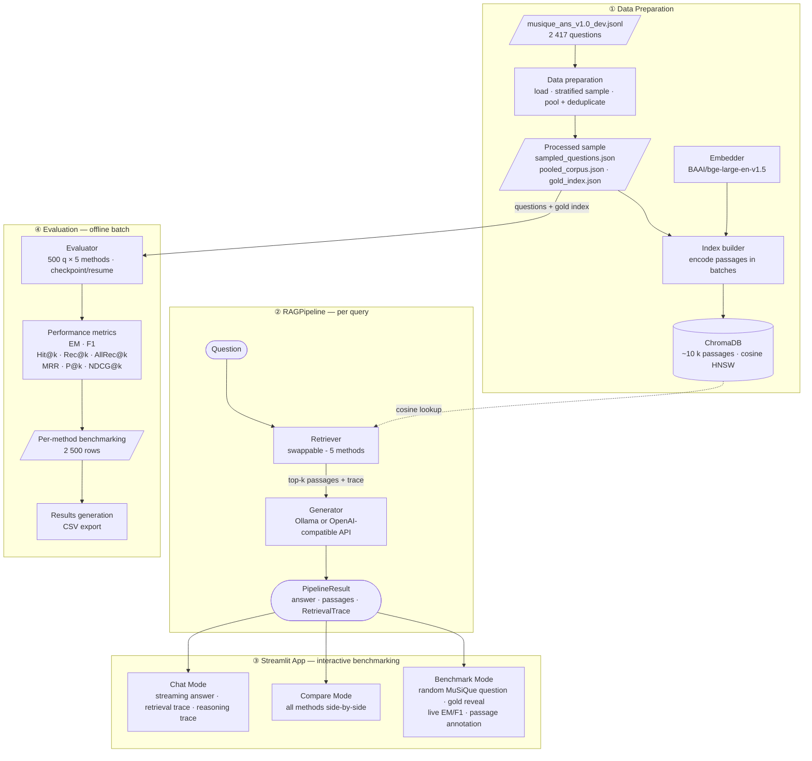

# nlp-rag-bench

#### NLP — Multi-Hop QA RAG Methods Benchmark

Coursework project for NLP. A practical benchmark and interactive application comparing retrieval-augmented generation (RAG) strategies on **open-domain multi-hop question answering**, using the MuSiQue dataset. The central thesis: **classic RAG handles single-hop reasoning well but degrades sharply as questions require more reasoning steps; training-free retrieval-side improvements can recover much of that gap without modifying the generator**.

---

## Task: Open-Domain Multi-Hop Question Answering

Given a question $q$ and a passage corpus $\mathcal{C} = \{p_1, \ldots, p_N\}$, the system must produce an answer string $a$. Solving the task requires (1) identifying a set of supporting passages $\mathcal{S} \subseteq \mathcal{C}$, and (2) synthesizing $a$ from $\mathcal{S}$. In multi-hop QA, $|\mathcal{S}| \geq 2$ and the passages must be combined via reasoning (e.g., *"Who is the spouse of the performer of Imagine?"* → identify performer in one passage, find their spouse in another).

This sits at the intersection of three NLP sub-tasks:
- **Information Retrieval** — ranking passages by relevance to the query
- **Reading Comprehension / Answer Generation** — producing an answer from retrieved context
- **Multi-Hop Reasoning** — combining facts across multiple passages

The project's contribution is a **comparative evaluation of retrieval strategies within the RAG paradigm**, with results stratified by reasoning depth (2/3/4 hops) to expose how different methods scale with question difficulty.

---

## Dataset: MuSiQue

[MuSiQue](https://github.com/StonyBrookNLP/musique) (Trivedi et al., 2022) is a multi-hop QA benchmark constructed by composing verified single-hop questions into 2-, 3-, and 4-hop chains. Unlike HotpotQA, MuSiQue actively filters out shortcut-solvable questions, making it a stronger benchmark for distinguishing RAG methods.

### Structure (MuSiQue-Answerable, dev split)

Each question is one JSON object:

```json
{
  "id": "2hop__123_456",
  "question": "Who is the spouse of the performer of Imagine?",
  "answer": "Yoko Ono",
  "answer_aliases": ["Ono Yoko"],
  "question_decomposition": [
    {"id": 0, "question": "Who performed Imagine?", "answer": "John Lennon", "paragraph_support_idx": 3},
    {"id": 1, "question": "Who is the spouse of #1 ?", "answer": "Yoko Ono", "paragraph_support_idx": 17}
  ],
  "paragraphs": [
    {"idx": 0, "title": "...", "paragraph_text": "...", "is_supporting": false},
    ...
    {"idx": 3, "title": "John Lennon", "paragraph_text": "...", "is_supporting": true}
  ]
}
```

Key fields:
- `question`, `answer`, `answer_aliases` — input and gold output
- `paragraphs[].is_supporting` — flags gold passages (used for retrieval metrics)
- `id` prefix (`2hop__`, `3hop1__`, `4hop1__`, …) — encodes hop count for stratification
- `question_decomposition` — gold reasoning chain (used for analysis only, never for retrieval)

### Sampling strategy

We use the **dev split** (test labels are not public) and sample **500 questions stratified by hop count**: 200 × 2-hop, 200 × 3-hop, 100 × 4-hop. This is enough for stable metrics and runs end-to-end in a few hours on a laptop.

### Corpus construction

MuSiQue ships ~20 candidate paragraphs per question (2–4 gold + ~16 distractors). We build a **pooled corpus**: deduplicated union of all paragraphs across all sampled questions (~10k unique passages). Deduplication is by SHA-1 content hash, and each passage records all source question IDs it appeared in. This makes retrieval competitive — gold passages must compete against distractors from *other* questions, not just their own.

No additional chunking is needed — MuSiQue passages are already paragraph-sized.

---

## RAG Methods Compared

We compare **4 RAG methods plus a no-RAG baseline (five total)**. All methods are **training-free retrieval-side techniques**: they share the same dense index, the same generator, and the same prompt template — only the retrieval orchestration changes. This isolates the retrieval variable for a fair comparison.

| # | Method | Description | Reference |
|---|--------|-------------|-----------|
| 1 | **No-RAG baseline** | Bare LLM call, empty context | Quantifies parametric memory; lower bound |
| 2 | **Classic RAG** | Top-k dense retrieval (cosine similarity) with title diversification | Lewis et al. (2020) |
| 3 | **Cross-encoder re-ranking** | Retrieve top-40 with bi-encoder, re-rank with cross-encoder, keep top-8 | Nogueira & Cho (2019) |
| 4 | **Query decomposition** | LLM splits the question into self-contained sub-questions, retrieves per sub-question, merges with RRF | Trivedi et al. (2023) — IRCoT |
| 5 | **Iterative decomposition** | Like decomposition, but after each hop generates an intermediate answer and rewrites the next sub-question to resolve bridge entities by name | Trivedi et al. (2023) — IRCoT |

**Note on training:** none of these methods require training any model. The cross-encoder is loaded pre-trained from HuggingFace; the decomposer is the same LLM used as the generator, prompted differently. Everything is inference + evaluation.

### Design details

**Classic RAG — title diversification.** The `NaiveRetriever` fetches 3× the requested top-k and then applies a title-level diversity filter (at most 2 passages per article title) before returning top-k. This prevents a single article from crowding out topically distinct evidence.

**Re-ranking.** `ReRankRetriever` wraps `NaiveRetriever`: it fetches 40 candidates (with diversification disabled so the cross-encoder sees the full ranked pool), scores every `(query, passage)` pair with the cross-encoder, and returns the top-8 by sigmoid-normalized rerank score. The re-ranker model is `BAAI/bge-reranker-base`.

**Query decomposition — static mode.** `DecompositionRetriever` prompts the LLM to split the question into 2–4 numbered, self-contained sub-questions (no anaphoric references). Each is retrieved independently via `NaiveRetriever`. Results are merged with **Reciprocal Rank Fusion (RRF, c=60)** rather than simple deduplication: every passage's score is the sum of `1/(c + rank)` across lists, rewarding passages that rank highly in multiple sub-queries.

**Query decomposition — iterative mode.** After retrieving passages for each sub-question, the pipeline generates an **intermediate answer** from the top-4 passages. If the answer is deemed useful (not a refusal marker, between 2 and 150 chars), it is carried forward as a known fact. The *next* sub-question is then rewritten by the LLM to substitute the resolved entity by name (e.g., "Who is the spouse of the actor?" + "Paul Bettany" → "Who is Paul Bettany's spouse?"). This directly targets bridge entities in subsequent retrievals. Results across all enriched sub-queries are still merged with RRF.

---

## Generator Model Choice

We use a **small open-weight LLM via Ollama** rather than a frontier API model. Frontier models (GPT-4, Claude) have memorized large portions of Wikipedia, so the no-RAG baseline scores artificially high on MuSiQue and the gaps between RAG methods compress. A 7B open model has weaker parametric memory, producing cleaner, more visible RAG gains.

**Used in evaluation:** `qwen2.5:7b-instruct` via Ollama.

**Alternatives:** `llama3.1:8b-instruct-q4_K_M`, `llama3.2:3b`, `qwen2.5:3b-instruct` — all work with the same setup.

The generator supports two backends, selectable via environment variables:
- **`ollama`** (default) — native Ollama Python SDK against a local or remote Ollama server
- **`openai`** — any OpenAI-compatible HTTP endpoint (Together AI, vLLM, LM Studio, etc.) with optional bearer token auth

**Memorization check:** run `memorization_check.py` to evaluate the LLM with no retrieval on 50 random questions. The no-RAG F1 of 0.037 (3.7%) confirms the model is not memorizing MuSiQue answers.

---

## Embedding Model Choice

The embedder is fixed across all retrieval methods and used both at indexing time and at query time. The default is **`BAAI/bge-large-en-v1.5`** — top MTEB retrieval scores, well-suited to Wikipedia-style passages.

| Model | Dim | Notes |
|---|---|---|
| **`BAAI/bge-large-en-v1.5`** ✓ used | 1024 | Highest retrieval quality in the BGE family; requires query prefix |
| `BAAI/bge-base-en-v1.5` | 768 | Good balance of quality and speed |
| `BAAI/bge-small-en-v1.5` | 384 | Fast, smaller footprint |
| `intfloat/e5-base-v2` | 768 | Strong retrieval; requires `"query: "` / `"passage: "` prefixes |
| `nomic-ai/nomic-embed-text-v1.5` | 768 | Recent, strong; requires `"search_query: "` / `"search_document: "` prefixes |

**BGE query prefix:** BGE models require a task instruction prepended to queries at inference time — `"Represent this sentence for searching relevant passages: "` — but no prefix for passages. This is handled automatically by the `Embedder` class via a `PREFIXED_MODELS` lookup table.

**Important:** the embedder choice is bound to the index. Different models produce different vectors with different dimensions, so swapping the embedder requires rebuilding the index. Each model gets its own directory under `chroma_db/<model_slug>/` so multiple indexes can coexist.

---

## Evaluation Metrics

All metrics computed per question, then aggregated by `(method, hop_count)` slices.

### Retrieval (using `is_supporting` paragraphs as ground truth)

| Metric | Definition |
|---|---|
| **Hit@k** | Did *any* gold paragraph appear in the top-k? |
| **Recall@k** | Fraction of gold paragraphs retrieved in top-k |
| **All-Recall@k** | Were *all* gold paragraphs retrieved? (strict multi-hop metric) |
| **MRR** | Mean reciprocal rank of the first gold paragraph |
| **Precision@k** | Fraction of retrieved passages that are gold (noise ratio) |
| **NDCG@k** | Normalized Discounted Cumulative Gain; rewards gold passages ranked higher |

### Generation (using `answer` + `answer_aliases` as references)

| Metric | Definition |
|---|---|
| **Exact Match (EM)** | Strict match after SQuAD-style normalization (lowercase, strip articles/punct) |
| **Token F1** | Token-level overlap with gold answer; best match across all references |

All generation metrics take the best score over `answer` + `answer_aliases` so valid paraphrases are not penalized.

---

## Results

All five methods evaluated on 500 questions (200 × 2-hop, 200 × 3-hop, 100 × 4-hop). Generator: `qwen2.5:7b-instruct`. Embedder: `BAAI/bge-large-en-v1.5`. Top-k: 8.

### Generation metrics (EM / Token F1)

| Method | EM (2h) | F1 (2h) | EM (3h) | F1 (3h) | EM (4h) | F1 (4h) |
|---|---|---|---|---|---|---|
| No-RAG | 0.020 | 0.042 | 0.000 | 0.033 | 0.000 | 0.031 |
| Classic RAG | 0.175 | 0.241 | 0.100 | 0.167 | 0.060 | 0.116 |
| Re-ranking | 0.265 | 0.363 | 0.205 | 0.321 | 0.080 | 0.156 |
| Decomposition | 0.375 | 0.460 | 0.195 | 0.289 | 0.100 | 0.178 |
| Iterative Decomposition | **0.490** | **0.580** | **0.335** | **0.409** | **0.130** | **0.225** |

### Retrieval metrics (Recall@k / All-Recall@k)

| Method | Rec@k (2h) | AllRec@k (2h) | Rec@k (3h) | AllRec@k (3h) | Rec@k (4h) | AllRec@k (4h) |
|---|---|---|---|---|---|---|
| No-RAG | — | — | — | — | — | — |
| Classic RAG | 0.680 | 0.435 | 0.568 | 0.175 | 0.453 | 0.060 |
| Re-ranking | 0.642 | 0.360 | 0.589 | 0.165 | 0.504 | 0.090 |
| Decomposition | 0.735 | 0.510 | 0.580 | 0.165 | 0.488 | 0.090 |
| Iterative Decomposition | **0.838** | **0.715** | **0.637** | **0.270** | **0.577** | **0.130** |

**Key findings:**
- No-RAG F1 of 3.7% confirms `qwen2.5:7b` has minimal MuSiQue memorization, producing clean RAG deltas.
- Classic RAG degrades sharply with hop count (F1: 0.241 → 0.167 → 0.116). Its single-query retrieval fails to gather all required evidence hops.
- Re-ranking adds a large uniform gain (~5 pp EM) primarily from improved cross-encoder scoring, but All-Recall@k actually drops slightly versus Classic RAG — the cross-encoder excels at ranking but the candidate pool is unchanged.
- Static decomposition improves 2-hop the most (+10 pp EM over re-ranking at 2h) but is less consistent at 3–4 hops, where individual sub-questions may still fail to resolve bridge entities by name.
- Iterative decomposition is the strongest method across all hop counts. The intermediate answer → sub-question rewrite step directly addresses the bridge-entity bottleneck. All-Recall@k jumps from 0.510 to 0.715 at 2-hop, confirming it gathers all supporting passages more reliably. The gap widens with hop count, which is the expected behavior for an iterative chain-of-thought style retriever.

---

## Application

A Streamlit app with three modes:

### 1. Chat Mode (primary UX)
- Free-form question input with streaming responses
- Sidebar: method selector, top-k slider, generator model display
- Each answer comes with an expandable **"Retrieved context"** panel showing passages, their scores, and source paragraph titles
- For decomposition methods: a **"Reasoning trace"** panel showing sub-questions, enriched queries (iterative mode), and intermediate answers (iterative mode)
- For re-ranking: trace shows rerank scores alongside original passages

### 2. Compare Mode
- One question, all methods run in parallel
- Side-by-side answer columns with per-method retrieval traces
- The signature screenshot for the project: same question, no-RAG fails, classic RAG partially answers, iterative decomposition chains the hops correctly

### 3. Benchmark Mode
- Pull a random question from the sampled MuSiQue set (filterable by hop count)
- Reveal toggles for the gold answer and gold supporting paragraphs
- Run all methods, display answers and per-question metrics live with ✓/✗ annotations for retrieved-vs-gold passages
- Lets a user *experience* the difficulty curve rather than just read it in the report

The app degrades gracefully: if the vector index has not been built, only the No-RAG pipeline is available; if the LLM backend is unreachable, an error banner is shown before anything loads.

---

## Technology Stack

| Component | Choice | Notes |
|---|---|---|
| **Vector store** | ChromaDB (persistent) | In-process, no server needed; HNSW cosine index |
| **Embeddings** | `BAAI/bge-large-en-v1.5` via `sentence-transformers` | Swappable via config; query prefix handled automatically |
| **Re-ranker** | `BAAI/bge-reranker-base` | Cross-encoder; runs on CPU or MPS |
| **Generator LLM** | Ollama (`qwen2.5:7b-instruct`) or any OpenAI-compatible endpoint | Backend selectable via `RAGBENCH_API_SRC` env var |
| **Merge strategy** | Reciprocal Rank Fusion (RRF, c=60) | Used by both decomposition modes to merge per-sub-query results |
| **UI** | Streamlit | Three-mode layout (chat / compare / benchmark); streaming responses |
| **Evaluation** | Custom (EM, F1, Hit@k, Recall@k, All-Recall@k, MRR, P@k, NDCG@k) | SQuAD-style normalization; checkpoint/resume; LaTeX export |
| **Dataset** | MuSiQue-Answerable v1.0 (dev split) | Sampled 500 questions stratified by hop count |
| **Package manager** | `uv` | Python 3.11+ required |

---

## Project Structure

```
nlp-rag-bench/
├── pyproject.toml
├── .env.example                  # API keys template and env var reference
├── data/
│   ├── musique/
│   │   └── musique_ans_v1.0_dev.jsonl
│   └── processed/
│       ├── sampled_questions.json    # 500 stratified questions
│       ├── pooled_corpus.json        # ~10k deduplicated paragraphs
│       └── gold_index.json           # {question_id: [doc_id, ...]}
├── chroma_db/                    # persisted vector stores, one per embedder (gitignored)
│   └── bge-large-en-v1.5/
├── results/                      # per-method CSVs + merged results.csv
│   ├── no_rag.csv
│   ├── classic_rag.csv
│   ├── re_ranking.csv
│   ├── decomposition.csv
│   ├── iterative_decomposition.csv
│   └── results.csv               # merged across all methods
├── src/
│   └── ragbench/
│       ├── __init__.py
│       ├── config.py             # pydantic-settings: paths, model names, top-k, devices
│       ├── factory.py            # build_pipelines(): constructs all 5 pipelines from shared components
│       ├── pipeline.py           # RAGPipeline: run() (blocking) + stream() (for the UI)
│       ├── data/
│       │   ├── loader.py         # parse MuSiQue JSONL, extract hop count from id prefix
│       │   ├── sampler.py        # stratified sampling by hop count, fixed seed
│       │   └── corpus.py         # pool + deduplicate paragraphs; build gold_index
│       ├── indexing/
│       │   ├── embedder.py       # Embedder wrapper; PREFIXED_MODELS for query/passage prefixes
│       │   └── builder.py        # encode corpus in batches, persist to ChromaDB; build_index / load_collection
│       ├── retrievers/
│       │   ├── base.py           # Retriever Protocol; RetrievedPassage; RetrievalTrace
│       │   ├── naive.py          # NaiveRetriever: dense top-k with title diversification
│       │   ├── reranking.py      # ReRankRetriever: bi-encoder candidates → cross-encoder rerank
│       │   └── decomposition.py  # DecompositionRetriever: static (RRF) and iterative (bridge-entity rewrite) modes
│       ├── generation/
│       │   ├── llm.py            # Generator: Ollama + OpenAI-compatible backends; generate() + stream()
│       │   └── prompts.py        # RAG_PROMPT, NO_RAG_PROMPT, DECOMPOSITION_PROMPT, INTERMEDIATE_PROMPT, REWRITE_PROMPT
│       ├── evaluation/
│       │   ├── metrics.py        # EM, F1, Hit@k, Recall@k, All-Recall@k, MRR, P@k, NDCG@k
│       │   ├── judge.py          # stub: LLM-as-judge (not implemented)
│       │   └── evaluator.py      # evaluate_method(): checkpoint/resume CSV writer
│       └── app/
│           ├── streamlit_app.py  # entrypoint; tab layout; health check; cached resource loading
│           ├── chat_mode.py      # streaming chat with retrieval trace
│           ├── compare_mode.py   # side-by-side all methods
│           ├── benchmark_mode.py # random MuSiQue question with gold reveal
│           └── components.py     # shared UI rendering helpers
└── scripts/
    ├── download_data.py          # CLI: download + unpack MuSiQue from Google Drive or local zip
    ├── prepare_data.py           # CLI: load → sample → pool → save processed/
    ├── build_index.py            # CLI: embed pooled corpus → persist ChromaDB
    ├── memorization_check.py     # CLI: no-RAG baseline on 50 questions
    ├── sanity_check.py           # CLI: end-to-end smoke test on a single question
    ├── evaluate.py               # CLI: run all methods, checkpoint per-method CSVs, print table
    └── analyze_results.py        # CLI: aggregate results.csv; rich tables + optional LaTeX export
```

---

## Pipeline / Process



### Per evaluation run (offline)

```
for method in [no_rag, classic_rag, reranking, decomposition, iterative_decomposition]:
    for question in sampled_500:
        result  = pipeline.run(question)
        record(retrieval_metrics(result.passages, gold_index[question.id]),
               generation_metrics(result.answer, question.answer + aliases),
               hop_count(question.id))
    checkpoint per-method CSV after each question

merge CSVs → results/results.csv
aggregate by (method, hops) → print headline table
```

The retriever is the only swappable component. Generator, embedder, prompt, and corpus are fixed across all methods — that's what makes the comparison fair.

---

## Repository Setup

### Prerequisites

- Python 3.11+
- [uv](https://github.com/astral-sh/uv) for package management
- [Ollama](https://ollama.com/) for local LLM inference (or any OpenAI-compatible API endpoint)
- ~15GB disk space (corpus + ChromaDB + LLM weights)

### Initial setup

```bash
# Clone and enter the repo
git clone <repo-url> nlp-rag-bench && cd nlp-rag-bench

# Install dependencies
uv sync

# Install with dev extras (notebooks, formatting, type-checking)
uv sync --extra dev

# Copy and configure environment variables
cp .env.example .env

# Pull the generator LLM (default)
ollama pull qwen2.5:7b-instruct

# Download the MuSiQue dataset
# Get the Google Drive file ID from https://github.com/StonyBrookNLP/musique
# then run:
uv run python scripts/download_data.py --gdrive-id <FILE_ID>
# Or, if you downloaded the zip manually:
uv run python scripts/download_data.py --zip path/to/musique.zip
```

### Running the pipeline

```bash
# 1. Prepare data (load + sample + pool corpus)
uv run python scripts/prepare_data.py

# 2. Build the vector index (under chroma_db/<embedder_slug>/)
uv run python scripts/build_index.py

# 3. Sanity check: confirm LLM doesn't memorize MuSiQue answers
uv run python scripts/memorization_check.py

# 4. Run full evaluation across all 5 methods (checkpoint/resume supported)
uv run python scripts/evaluate.py

# 5. Aggregate results and print tables (add --latex for LaTeX source)
uv run python scripts/analyze_results.py
uv run python scripts/analyze_results.py --latex --output report/tables.tex

# 6. Launch the interactive application
uv run streamlit run src/ragbench/app/streamlit_app.py
```

### Configuring the LLM backend

All settings can be overridden with `RAGBENCH_*` environment variables or in `.env`:

```bash
# Use a different local model
RAGBENCH_GENERATOR_MODEL=llama3.1:8b-instruct-q4_K_M

# Use an OpenAI-compatible remote endpoint (e.g., Together AI)
RAGBENCH_API_SRC=openai
RAGBENCH_API_URL=https://api.together.xyz
RAGBENCH_API_AUTH_BEARER=<your-token>
RAGBENCH_GENERATOR_MODEL=google/gemma-4-31B
```

### Switching the embedding model

Edit `embedding_model` in `src/ragbench/config.py` (or set `RAGBENCH_EMBEDDING_MODEL`), then rerun `build_index.py`. Each model gets its own directory under `chroma_db/`, so multiple indexes can coexist.

---

## References

- **Dataset:** Trivedi, Balasubramanian, Khot, Sabharwal (2022). *"MuSiQue: Multihop Questions via Single-hop Question Composition."* TACL. [arXiv:2108.00573](https://arxiv.org/abs/2108.00573)
- **RAG:** Lewis et al. (2020). *"Retrieval-Augmented Generation for Knowledge-Intensive NLP Tasks."* NeurIPS 2020. [arXiv:2005.11401](https://arxiv.org/abs/2005.11401)
- **Re-ranking:** Nogueira & Cho (2019). *"Passage Re-ranking with BERT."* [arXiv:1901.04085](https://arxiv.org/abs/1901.04085)
- **Decomposition (IRCoT):** Trivedi et al. (2023). *"Interleaving Retrieval with Chain-of-Thought Reasoning for Knowledge-Intensive Multi-Step Questions."* ACL 2023. [arXiv:2212.10509](https://arxiv.org/abs/2212.10509)
- **Bi-encoder framework:** Reimers & Gurevych (2019). *"Sentence-BERT."* EMNLP 2019. [arXiv:1908.10084](https://arxiv.org/abs/1908.10084)
- **Reciprocal Rank Fusion:** Cormack, Clarke, Buettcher (2009). *"Reciprocal Rank Fusion Outperforms Condorcet and Individual Rank Learning Methods."* SIGIR 2009.
- **Embeddings / Re-ranker:** BGE model family (Beijing Academy of AI). [BAAI/bge-large-en-v1.5](https://huggingface.co/BAAI/bge-large-en-v1.5), [BAAI/bge-reranker-base](https://huggingface.co/BAAI/bge-reranker-base)
